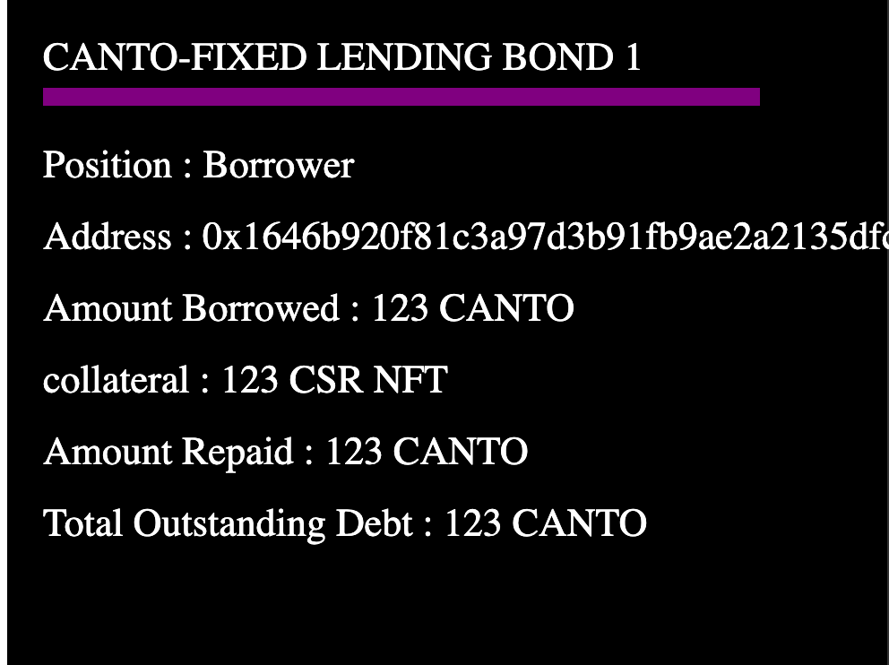
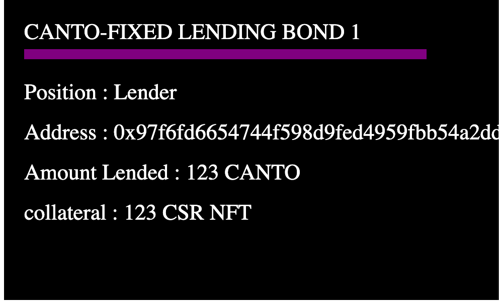

# ENTRY #1 - Canto Fixed Lending 
 - CSR nft can be used as a collateral to get loan.
 - Requesting loan
    - CSR nft holder can request a loan for specific principalAmount and maxInterestRate
 - Bidding for loan
    - interested people can show interest by bidding 
 - Bond
    - once supply and demand met,loan will be issued to CSR nft holder by taking CSR nft as collateral
    - lender will receive lenderNFT. lenderNFT holder can claim the amountRepaid.
    - borrower will receive borrowerNFT. borrowerNFT holder has to repay the debt and can claim CSR nft back
    - borrowerNFT dynamically updates debt details

