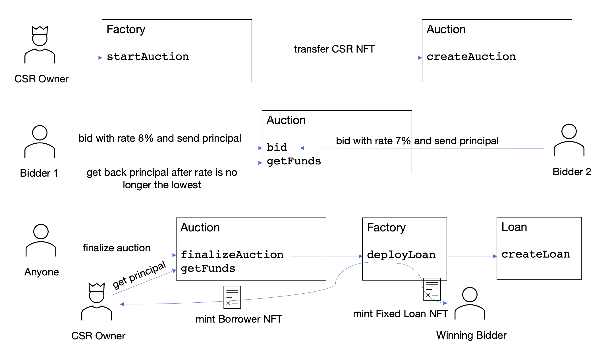

# ENTRY #6 - Canto Fixed Lending

Canto Fixed Lending is a protocol for borrowing against [CSR](https://github.com/Canto-Improvement-Proposals/CIPs/blob/main/CIP-001.md) NFTs. Besides paying back the accrued debt directly (`Loan.repayWithExternal`), the revenue of the NFT can also be claimed and be used to pay back the debt (`Loan.repayWithClaimable`). The lender can use `Loan.withdrawPayable` to withdraw from the already paid back amount.

The protocol includes an auction mechanism. The owner of a CSR who wants to take a loan creates an auction (with a principal amount for the loan) and the bid with the lowest interest rate wins. A typical auction is shown in this diagram:

The owner of the CSR NFT uses the factory to start the auction. The factory in turn transfers the CSR NFT to the auction contract and initiates the auction there.
Afterwards, bidders can bid on the auction. When a new bid with a lower rate is placed, the old bidder can use `getFunds()` to get his funds back.
After the auction has ended, anyone can call `finalizeAuction`. If it was successful, the CSR owner gets a borrower NFT and the winning bidder a fixed loan NFT. Those will be used for claiming within the Loan contract. Therefore, they could also be traded, as they grant the user access to a future cash flow (or to an NFT when he pays back the debt). The owner of the CSR NFT uses `getFunds()` to get the principal out of the contract.

Note that the rate is always in 10 BPS, i.e. a rate of 85 means 8.5%.

## Deployment
Only the `Factory` contract needs to be deployed with the appropriate parameters, it will create all other contracts.

## Testing
Currently, no tests for the protocol are provided.
